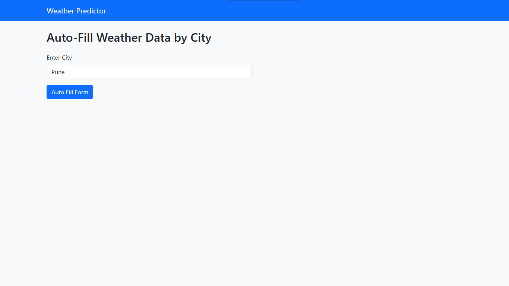
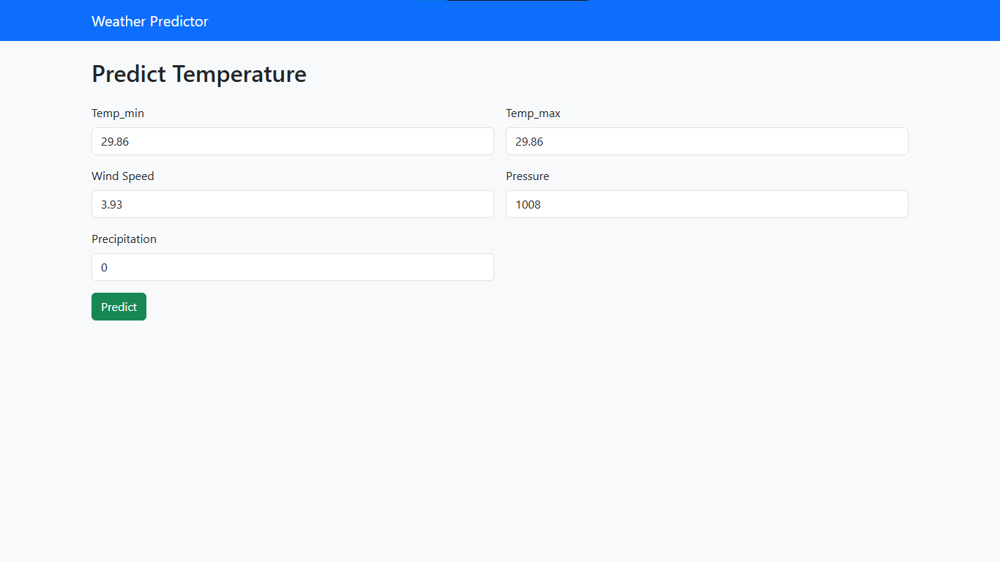
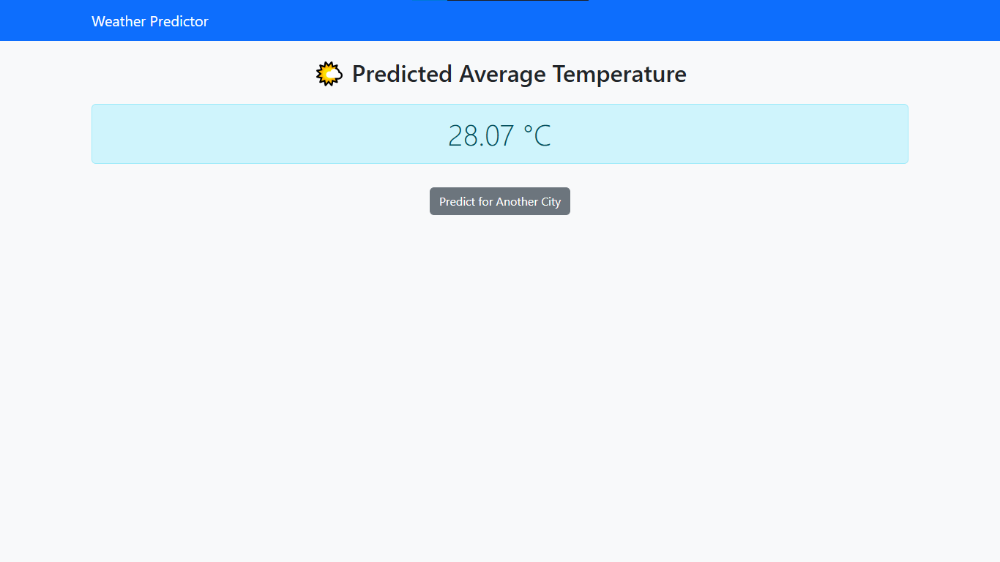

# 🌤️ Weather Predictor with Machine Learning

A web-based weather forecasting system that predicts the average temperature using machine learning. Built using **Go** (Gorilla Mux) for the main web app and **FastAPI** (Python) as a microservice for ML-based prediction.

---

## 📌 Features

- 🔍 **City-Based Auto-Fill:** Enter a city and get real-time historical weather data auto-filled.
- 🤖 **ML Prediction:** Predict average temperature (`tavg`) using features like `tmin`, `tmax`, `wspd`, `pres`, and `prcp`.
- 🔁 **Microservice Architecture:** Go handles routing and UI, while FastAPI handles model prediction.
- 🎨 **Modern UI:** Clean and responsive UI using Bootstrap 5.
- ⚡ **Fast & Lightweight:** Efficient communication between Go and Python services using JSON.

---

## 🏗️ Tech Stack

| Layer           | Tech Used              |
|----------------|------------------------|
| Frontend       | HTML, Bootstrap 5      |
| Backend        | Go, Gorilla Mux        |
| ML Microservice| Python, FastAPI, scikit-learn |
| Model Training | pandas, numpy, Meteostat |
| Templates      | Go's html/template     |
| Prediction     | Linear Regression      |

---

## 🚀 Getting Started

### 1. Clone the Project

```bash
git clone https://github.com/PJ9172/Weather_Prediction.git
cd Weather_Prediction
```

### 2. Start the FastAPI ML Server
```bash
uvicorn main:app --reload
```

### 3. Start the Go Web App
```bash
go run main.go
```

## 🔍 Usage

- Visit http://localhost:3000/

- Enter a city name (e.g., Pune)

- The form auto-fills weather features

- Click "Predict" to see the predicted average temperature

## 🧠 ML Model
- Algorithm: Linear Regression

- Training Data: Historical weather data from Meteostat

- Target Variable: tavg (Average Temperature)

- Input Features: tmin, tmax, wspd, pres, prcp

## 📸 Screenshots
   
   
   

## 🤝 Credits
- Go + Gorilla Mux for clean server-side routing

- FastAPI for fast Python microservice

- Meteostat for open historical weather data

- Bootstrap for beautiful, responsive UI